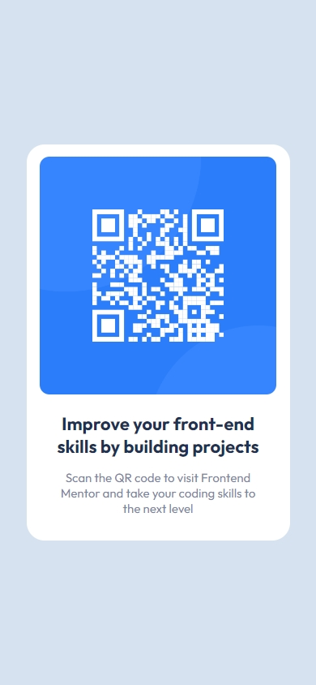

# Frontend Mentor - QR code component solution

This is a solution to the [QR code component challenge on Frontend Mentor](https://www.frontendmentor.io/challenges/qr-code-component-iux_sIO_H). Frontend Mentor challenges help you improve your coding skills by building realistic projects. 

### Table of contents

- [Overview](#overview)
  - [The challenge](#the-challenge)
  - [Screenshot](#screenshot)
  - [Links](#links)
- [My process](#my-process)
  - [Built with](#built-with)
  - [What I learned](#what-i-learned)
  - [Continued development](#continued-development)
  - [Useful resources](#useful-resources)
- [Author](#author)
- [Acknowledgments](#acknowledgments)

## Overview

### The challenge

- This Frontend Mentor challenge is to create a QR code component using HTML and CSS. The goal is to replicate a provided design that includes a QR code, a title, a paragraph, and a container card. It is an excellent practice to improve your skills in web layout and styling.

### Screenshot

### Links

- Solution URL: [Add solution URL here](https://github.com/eduardoe92/Challenge/tree/main/01-QR%20Challenge/qr-code-component-main)
- Live Site URL: [Add live site URL here](https://qrchallenge-frontendmentor.vercel.app/)

## My Process

## Built with

- Semantic HTML5 markup
- CSS custom properties
- Flexbox
- CSS
- Mobile-first workflow

## What I learned

- Mastery in the design and structuring of QR code components.
- Significant improvement in the use of Flexbox and CSS to achieve a fully responsive design.

## Continued Development

-Working with challenging designs provided in tools like Figma has been a valuable experience for my professional growth.

- Maintain and deepen my knowledge in HTML and CSS, fundamental pillars for modern and adaptive web development.

## Useful Resources

- [HTML5 Documentation](https://developer.mozilla.org/es/docs/Web/HTML) - Essential reference to understand and correctly use HTML tags.

- [CSS](https://developer.mozilla.org/es/docs/Web/CSS) - Official documentation to take full advantage of CSS capabilities in designs.

- [Figma](https://www.figma.com/) - Collaborative design tool that allows you to create prototypes and design user interfaces efficiently.

These resources will be very useful to continue learning and improving your skills in frontend development.

## Author

- Website - [Eduardo Chacon](https://eduardoeliaschacon-portfolio.vercel.app/)
- Frontend Mentor - [@eduardoe92](https://www.frontendmentor.io/profile/eduardoe92)
- Instagram - [@eduardo.e](https://www.instagram.com/eduardo.e)

## Acknowledgments

I thank [Frontend Mentor](https://www.frontendmentor.io) for providing practical challenges to improve my coding skills.
