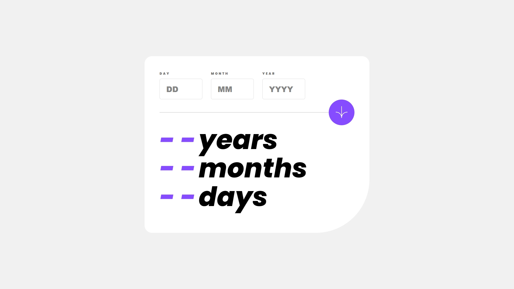

# Frontend Mentor - Age calculator app solution

This is a solution to the [Age calculator app challenge on Frontend Mentor](https://www.frontendmentor.io/challenges/age-calculator-app-dF9DFFpj-Q). Frontend Mentor challenges help you improve your coding skills by building realistic projects.

## Table of contents

- [Overview](#overview)
  - [The challenge](#the-challenge)
  - [Screenshot](#screenshot)
  - [Links](#links)
- [My process](#my-process)
  - [Built with](#built-with)
  - [What I learned](#what-i-learned)
  - [Continued development](#continued-development)
  - [Useful resources](#useful-resources)
- [Author](#author)
- [Acknowledgments](#acknowledgments)

## Overview

### The Challenge

Users should be able to:

- View an age in years, months, and days after submitting a valid date through the form
- Receive validation errors if:
  - Any field is empty when the form is submitted
  - The day number is not between 1-31
  - The month number is not between 1-12
  - The year is in the future
  - The date is invalid e.g. 31/04/1991 (there are 30 days in April)
- View the optimal layout for the interface depending on their device's screen size
- See hover and focus states for all interactive elements on the page
- **Bonus**: See the age numbers animate to their final number when the form is submitted

### Screenshot

### Links

- Solution URL: [Add solution URL here](https://github.com/eduardoe92/Challenge/tree/main/02-Age%20Calculator/age-calculator-app-main)
- Live Site URL: [Add live site URL here](https://agecalculator-frontendmentor.vercel.app/)

## My Process

### Built with

- Semantic HTML5 markup
- Java Script
- CSS custom properties
- Flexbox
- CSS Grid
- Mobile-first workflow

### What I learned

- I learned how to create a responsive age calculator app using HTML, CSS, and JavaScript.

- I gained experience in handling form inputs, performing validation checks, and displaying error messages dynamically.

- I improved my understanding of media queries and responsive design principles to ensure a consistent user experience across different devices.

- I practiced using CSS variables for easier theming and maintenance of the application's visual styles.

### Continued development

- I will continue learning and staying updated with the latest web development technologies and techniques to enhance my skills and create more sophisticated web applications.

- Working with challenging designs provided in tools like Figma has been a valuable experience for my professional growth.

- Maintain and deepen my knowledge in Java Script, HTML and CSS, fundamental pillars for modern and adaptive web development.

### Useful resources

- [HTML5 Documentation](https://developer.mozilla.org/es/docs/Web/HTML) - Essential reference to understand and correctly use HTML tags.

- [CSS](https://developer.mozilla.org/es/docs/Web/CSS) - Official documentation to take full advantage of CSS capabilities in designs.

- [Java Script](https://developer.mozilla.org/es/docs/Web/javascript) - Official documentation for understanding and using JavaScript effectively in web development, with detailed examples and guides.

- [Figma](https://www.figma.com/) - Collaborative design tool that allows you to create prototypes and design user interfaces efficiently.

These resources will be very useful to continue learning and improving your skills in frontend development.

## Author

- Website - [Eduardo Chacon](https://eduardoeliaschacon-portfolio.vercel.app/)
- Frontend Mentor - [@eduardoe92](https://www.frontendmentor.io/profile/eduardoe92)
- Instagram - [@eduardo.e](https://www.instagram.com/eduardo.e)

## Acknowledgments

I thank [Frontend Mentor](https://www.frontendmentor.io) for providing practical challenges to improve my coding skills.
