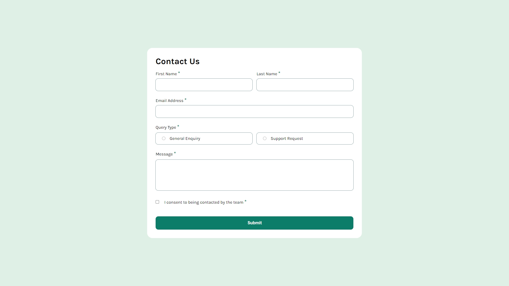

# Frontend Mentor - Contact form solution

This is a solution to the [Contact form challenge on Frontend Mentor](https://www.frontendmentor.io/challenges/contact-form--G-hYlqKJj). Frontend Mentor challenges help you improve your coding skills by building realistic projects. 

## Table of contents

- [Overview](#overview)
  - [The challenge](#the-challenge)
  - [Screenshot](#screenshot)
  - [Links](#links)
- [My process](#my-process)
  - [Built with](#built-with)
  - [What I learned](#what-i-learned)
  - [Continued development](#continued-development)
  - [Useful resources](#useful-resources)
- [Author](#author)
- [Acknowledgments](#acknowledgments)

## Overview

### The challenge

Users should be able to:

- Complete the form and see a success toast message upon successful submission
- Receive form validation messages if:
  - A required field has been missed
  - The email address is not formatted correctly
- Complete the form only using their keyboard
- Have inputs, error messages, and the success message announced on their screen reader
- View the optimal layout for the interface depending on their device's screen size
- See hover and focus states for all interactive elements on the page

### Screenshot

### Links

- Solution URL: [Add solution URL here](https://github.com/eduardoe92/Challenge/tree/main/03-Contact%20Form)
- Live Site URL: [Add live site URL here](https://contact-form-frontendmentor.vercel.app/)

## My process

### Built with

- Semantic HTML5 markup
- CSS custom properties
- Flexbox
- CSS Grid
- Mobile-first workflow

### What I learned

- HTML Structure: Structure forms effectively, including the use of tags, input elements, and error messages for validation.

- CSS Styling: Gained experience in designing forms and making them responsive using CSS Grid and media queries.

- JavaScript Interaction: JavaScript was used to validate form inputs, handle form submission, and display messages.

### Continued development

- CSS Flexbox – While you have used CSS Grid, consider learning more about CSS Flexbox as it can also be very useful for layout designs.

- Responsive Design: Maintain responsiveness by practicing design techniques, especially focusing on optimizing designs for various screen sizes and devices.

- Backend integration: The front-end form could be integrated with a backend service (such as Node.js with Express or a cloud service such as Firebase) for data storage and processing.

### Useful resources

- [HTML5 Documentation](https://developer.mozilla.org/es/docs/Web/HTML) - Essential reference to understand and correctly use HTML tags.

- [CSS](https://developer.mozilla.org/es/docs/Web/CSS) - Official documentation to take full advantage of CSS capabilities in designs.

- [Java Script](https://developer.mozilla.org/es/docs/Web/javascript) - Official documentation for understanding and using JavaScript effectively in web development, with detailed examples and guides.

- [Figma](https://www.figma.com/) - Collaborative design tool that allows you to create prototypes and design user interfaces efficiently.

These resources will be very useful to continue learning and improving your skills in frontend development.

## Author

- Website - [Eduardo Chacon](https://eduardoeliaschacon-portfolio.vercel.app/)
- Frontend Mentor - [@eduardoe92](https://www.frontendmentor.io/profile/eduardoe92)
- Instagram - [@eduardo.e](https://www.instagram.com/eduardo.e)

## Acknowledgments

I thank [Frontend Mentor](https://www.frontendmentor.io) for providing practical challenges to improve my coding skills.
