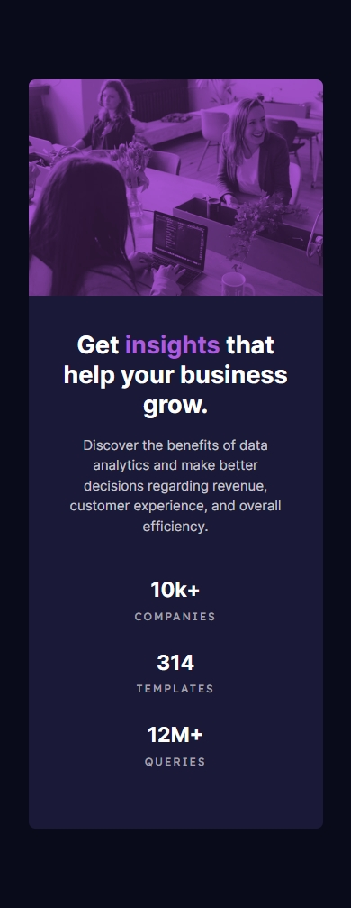

# Frontend Mentor - Stats preview card component solution

This is a solution to the [Stats preview card component challenge on Frontend Mentor](https://www.frontendmentor.io/challenges/stats-preview-card-component-8JqbgoU62). Frontend Mentor challenges help you improve your coding skills by building realistic projects. 

## Table of contents

- [Overview](#overview)
  - [The challenge](#the-challenge)
  - [Screenshot](#screenshot)
  - [Links](#links)
- [My process](#my-process)
  - [Built with](#built-with)
  - [What I learned](#what-i-learned)
  - [Continued development](#continued-development)
  - [Useful resources](#useful-resources)
- [Author](#author)
- [Acknowledgments](#acknowledgments)

## Overview

### The challenge

Users should be able to:

- View the optimal layout depending on their device's screen size

### Screenshot

### Links

- Solution URL: [Add solution URL here]()
- Live Site URL: [Add live site URL here]()

## My process

### Built with

- Semantic HTML5 markup
- CSS custom properties
- Flexbox
- CSS Grid
- Mobile-first workflow

**Note: These are just examples. Delete this note and replace the list above with your own choices**

### What I learned

### Continued development

### Useful resources

- [HTML5 Documentation](https://developer.mozilla.org/es/docs/Web/HTML) - Essential reference to understand and correctly use HTML tags.

- [CSS](https://developer.mozilla.org/es/docs/Web/CSS) - Official documentation to take full advantage of CSS capabilities in designs.

- [Java Script](https://developer.mozilla.org/es/docs/Web/javascript) - Official documentation for understanding and using JavaScript effectively in web development, with detailed examples and guides.

- [Figma](https://www.figma.com/) - Collaborative design tool that allows you to create prototypes and design user interfaces efficiently.

These resources will be very useful to continue learning and improving your skills in frontend development.

## Author

- Website - [Eduardo Chacon](https://eduardoeliaschacon-portfolio.vercel.app/)
- Frontend Mentor - [@eduardoe92](https://www.frontendmentor.io/profile/eduardoe92)
- Instagram - [@eduardo.e](https://www.instagram.com/eduardo.e)

## Acknowledgments

I thank [Frontend Mentor](https://www.frontendmentor.io) for providing practical challenges to improve my coding skills.
